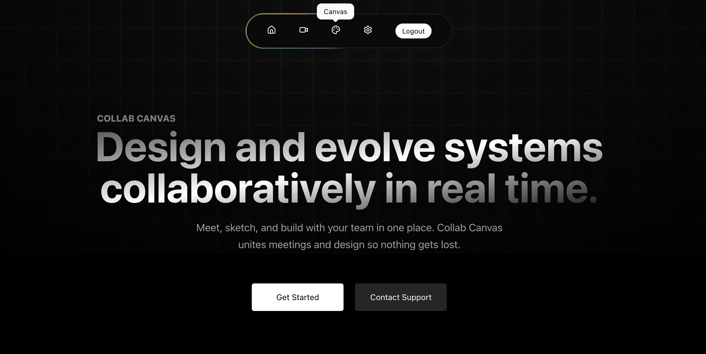

# ✨ Collab Canvas |  Design and evolve systems collaboratively in real time.✨
Meet, sketch, and build with your team in one place. Collab Canvas unites meetings and design so nothing gets lost.

## Overview

Collab Canvas is a full-stack SaaS application that allows teams to collaborate in real time using shared canvases, live meetings, and design tools — all in one place.

It is built for startups, remote teams, and individuals who want a unified workspace for discussion and creation.

## ✨ Features

- 🔐 User authentication & authorization
- 💬 Real-time chat and collaboration
- 🎨 Interactive canvas / whiteboard
- 📁 Persistent project & session storage
- ⚡ Fast and responsive UI
- 🌐 Scalable backend architecture
- Video Meeting 

## 🛠 Tech Stack

### Frontend
- Next.js
- Tailwind CSS
- WebSockets / Socket.IO

### Backend
- Node.js
- NestJS
- REST API
- Prisma ORM

### Database
- NeonDB / PostgreSQL 

```
### Clone github Repo
- git clone https://github.com/vivek-patel-here/Collab-Canvas.git 
- cd "Collab Canvas"

*Backend Setup*
- cd server
- npm install
- npm run start:dev


*Backend `.env` setup*

- DATABASE_URL='postgresql url'
- SUPABASE_URL="supabase url"
- SUPABASE_SERVICE_KEY="supabase service
- LIVEKIT_API_KEY="livekit api key"
- LIVEKIT_API_SECRET="livekit api secret"

*Client Setup*
- cd client
- npm install
- npm run dev

*Frontend `.env` setup*

-NEXT_PUBLIC_SUPABASE_URL="supabase url"
-NEXT_PUBLIC_SUPABASE_PUBLISHABLE_KEY="supabase publishable key"
-NEXT_PUBLIC_SUPABASE_KEY="supabase key"
-NEXT_PUBLIC_SUPABASE_REDIRECT_URL="your auth UI verify page url {http://localhost:3000/auth/verify} "
-NEXT_PUBLIC_SUPABASE_GOOGLE_CLIENT_ID="google client id"
-NEXT_PUBLIC_SUPABASE_GOOGLE_CLIENT_SECRET="google client secret"
-NEXT_PUBLIC_LIVEKIT_URL="livekit url"


```
## Deployment
The application can be deployed using Docker or cloud platforms like Vercel and Render.